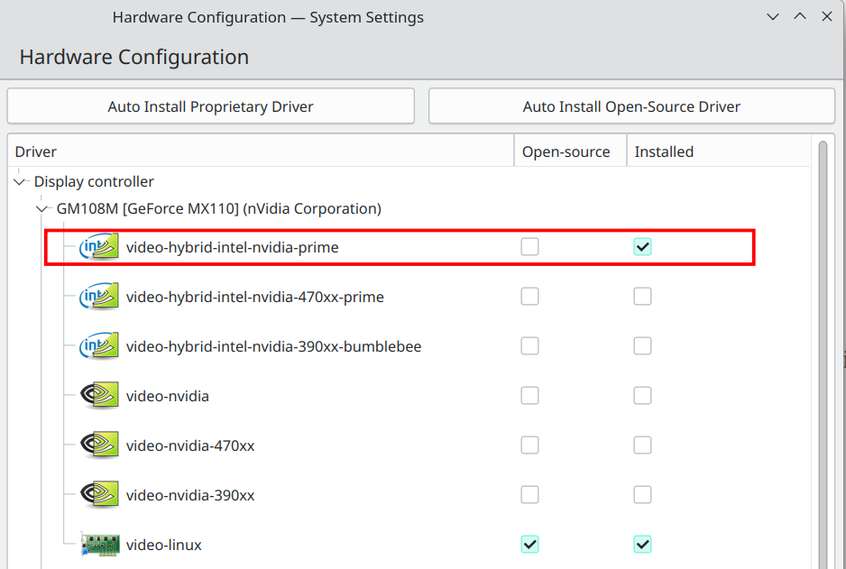

## change pacman source

- change source rank

choose mirror – `sudo pacman-mirrors -i -c China -m rank`

append the following at `/etc/pacman.conf`
```
[archlinuxcn]
SigLevel = TrustAll
Server = http://mirrors.tuna.tsinghua.edu.cn/archlinuxcn/$arch

[arch4edu]
SigLevel = TrustAll
Server = http://mirrors.tuna.tsinghua.edu.cn/arch4edu/$arch
```

import GPG key – `sudo pacman -Syy && sudo pacman -S archlinuxcn-keyring`

update system – `sudo pacman -Syu`

## git config
`git config --global user.name GuoKunchang && git config --global user.email 18213857028@163.com`

`ssh-keygen -t ed25519 -C "18213857028@163.com"`

## turn off beep

> [PC speaker](https://wiki.archlinux.org/title/PC_speaker)
> Another way is to uncomment or add this line in `/etc/inputrc` or `~/.inputrc`:
> `set bell-style none`

## install yay
`sudo pacman -Sy base-devel && sudo pacman -Sy yay`

## issue: [tsinghua no longer support aur source](https://blog.51cto.com/u_14597003/5989103)
remove all entries containing "aur.tsinghua.edu.cn"

## pinyin input method

> [你的下一个输入法何必是搜狗，拥抱fcitx5](https://mengxun.club/2020/12/28/%E4%BD%A0%E7%9A%84%E4%B8%8B%E4%B8%80%E4%B8%AA%E8%BE%93%E5%85%A5%E6%B3%95%E4%BD%95%E5%BF%85%E6%98%AF%E6%90%9C%E7%8B%97%EF%BC%8C%E6%8B%A5%E6%8A%B1fcitx5/)
>
> `sudo pacman -S fcitx5 fcitx5-chinese-addons fcitx5-chewing fcitx5-pinyin-zhwiki fcitx5-pinyin-moegirl fcitx5-config-qt fcitx5-gtk fcitx5-qt4 fcitx5-qt5 fcitx5-material-color`
>
> ```
> # ~/.pam_environment
> 
> GTK_IM_MODULE DEFAULT=fcitx
> QT_IM_MODULE  DEFAULT=fcitx
> XMODIFIERS    DEFAULT=\@im=fcitx
> SDL_IM_MODULE DEFAULT=fcitx
> ```
>
> ```
> # ~/.xporfile
> 
> export QT_IM_MODULE=fcitx5
> ```
>
> then open configure panel to select `pinyin`

## neovim
`sudo pacman -S neovim`

`git clone https://github.com/LazyVim/starter ~/.config/nvim && rm -rf ~/.config/nvim/.git && nvim`

## tmux

## clash
`https://feed.iggv5.com/c/ed54bd84-e6b6-4846-8567-61d5a3021203/platform/clash/iGG-iGuge`

## flameshot

`sudo pacman -S flameshot`

## typora

`yay -S typora`

## nvidia driver



to handle case that cuda randomly crashes causing `cuda init error`, 
execute `sudo modprobe -r nvidia_uvm && sudo modprobe nvidia_uvm`

## mozilla

- account recovery key – `AH1W 8WD7 KKFD HQ4C 3TRX Z03J VB14 83BD`

## zsh

- install oh-my-zsh – `curl -L http://install.ohmyz.sh | sh`
- change zsh as default – `chsh -s /bin/zsh`

## pytorch

`pip3 install torch torchvision torchaudio`

be careful to check if cuda version matches torch version

## zoxide

add `eval "$(zoxide init zsh)"` to `~/.zshrc`

## WPS
```
yay -S ttf-wps-fonts wps-office-mui-zh-cn wps-office-mime-cn wps-office-cn
yay -S wps-office-fonts ttf-ms-fonts
yay -S ttf-wps-fonts libtiff5
```

## pycharm
`pamac install pycharm-community-edition`

## wechat
install wine and winetricks, then set environments: 
```
export WINEARCH=win32
export WINEPREFIX=~/.wine32
```
install `fakechinese` fonts: `winetricks fakechinese`, 
then install wechat `wine [path to wechat_x86.exe]`
